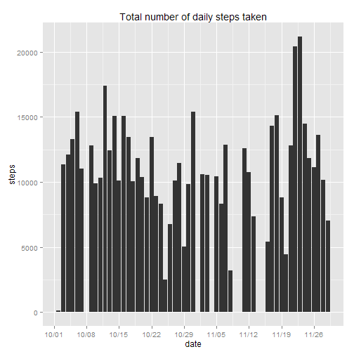

## Data processing

### 1. Loading Data


```r
library(ggplot2)
data<-read.csv("activity.csv")
```

## 2. Processing data

Scales library is used for formatting the date in ggplot
Lattice library is used for aggregate


```r
library(lattice)
library(scales)
```

### Saving steps data

```r
StepsSum<-aggregate(steps~date,data=data,sum,na.rm=TRUE)
StepsSum$date<-as.Date(StepsSum$date)
```

## Histogram of total number of steps taken each day

### 1. Plot the histogram


```r
plot1<-ggplot(StepsSum,aes(date,steps))+stat_summary(fun.y=sum,geom="bar")+scale_x_date(labels = date_format("%m/%d"),breaks="week")
plot1+ggtitle("Total number of daily steps taken")
```

 

### 2. What is mean total number of steps taken per day?

Mean:

Overall mean:


```r
mean(StepsSum$steps)
```

```
## [1] 10766
```

Mean per day:


```r
plot(tapply(data$steps,data$date,mean,na.rm=TRUE),xlab="Days",ylab="Mean steps",main="Mean steps per day")
```

 

Overall Median:


```r
median(StepsSum$steps)
```

```
## [1] 10765
```

Median per day (note they are all zeros except for days with all NA elements):


```r
plot(tapply(data$steps,data$date,median,na.rm=TRUE),xlab="Days",ylab="Median steps",main="Median steps per day")
```

 

## What is the average daily activity pattern?

### 1. Average number of steps taken, averaged across all days


```r
time <- tapply(data$steps, data$interval, mean, na.rm = TRUE)
plot(row.names(time), time, type = "l", xlab = "5-minute interval", 
    ylab = "Average for all Days", main = "Average number of steps taken", 
    col = "green")
```

 

### 2. The 5-minute interval with maximum number of steps


```r
max_step_interval <- which.max(time)
names(max_step_interval)
```

```
## [1] "835"
```

## Imputing missing values

### 1. Total number of rows with NAs


```r
sum(is.na(data))
```

```
## [1] 2304
```

### 2. Filling in all of the missing values in the dataset

The strategy is to fill the NAs with the interval mean


```r
StepsMean <- aggregate(steps ~ interval, data = data, FUN = "mean")
fillNA <- numeric()
for (i in 1:nrow(data)) {
    obs <- data[i, ]
    if (is.na(obs$steps)) {
        steps <- subset(StepsMean, interval == obs$interval)$steps
    } else {
        steps <- obs$steps
    }
    fillNA <- c(fillNA, steps)
}

new_data <- data
new_data$steps <- fillNA

StepsTotal2 <- aggregate(steps ~ date, data = new_data, sum, na.rm = TRUE)

StepsTotal2$date<-as.Date(StepsTotal2$date)

plot2<-ggplot(StepsTotal2,aes(date,steps))+stat_summary(fun.y=sum,geom="bar")+scale_x_date(labels = date_format("%m/%d"),breaks="week")
plot2+ggtitle("Total number of daily steps taken with NAs filled in")
```

 

<!--- This is the daily mean version in progress

dailymean <- tapply(data$steps, data$date, mean)
for i in (1:length(data[,1])){
    if is.NA(data[i,1]){
        for j in (1:length(dailymean) {
            if data$date[i]==dailymean[j] {
                data$steps<-dailymean[j]
            }
        }
    }
}
-->

## Differences in activity patterns between weekdays and weekends

Creating weekday and weekend variables


```r
data$date<-as.Date(data$date)
day <- weekdays(data$date)
daylevel <- vector()
for (i in 1:nrow(data)) {
    if (day[i] == "Saturday") {
        daylevel[i] <- "Weekend"
    } else if (day[i] == "Sunday") {
        daylevel[i] <- "Weekend"
    } else {
        daylevel[i] <- "Weekday"
    }
}
data$daylevel <- daylevel
data$daylevel <- factor(data$daylevel)

stepsByDay <- aggregate(steps ~ interval + daylevel, data = data, mean)
```

```
## Error: object 'FUN' of mode 'function' was not found
```

```r
names(stepsByDay) <- c("interval", "daylevel", "steps")
```

```
## Error: object 'stepsByDay' not found
```

Here are the 2 plots comparing the number of steps taken on average for weekdays and weekends:


```r
xyplot(steps ~ interval | daylevel, stepsByDay, type = "l", layout = c(1, 2), 
    xlab = "Interval", ylab = "Number of steps")
```

```
## Error: object 'stepsByDay' not found
```

